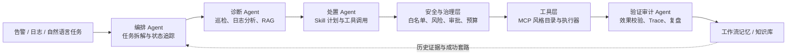

# ThreshCore Agent Infra：面向零人工运维的多 Agent 协同底座

> GOAI 2026 · Agent Infra（新智基座）赛道参赛项目

## 项目简介

传统运维依赖脚本、监控面板和人工经验：告警分散、根因定位慢、执行风险高，且处置过程很难复盘。ThreshCore Agent Infra 面向这一真实企业场景，提供以自然语言任务为入口的可控运维协同底座：系统将日志、巡检和告警线索组织为任务上下文，按“观察—诊断—计划—执行—验证—复盘”闭环调用受控工具，并沉淀 Trace、审计记录和可复用工作流。

项目的核心不是赋予模型无限制的 Shell 权限，而是把工具白名单、参数校验、风险分级、人工确认、效果校验和审计证据置于 Agent 执行链路中。当前工程已具备日志诊断、主机巡检、知识库/RAG、工具目录、风险门控、确认执行、工作流记忆和可观测接口等能力；本参赛方案以 **AgentTeams（原 Hiclaw）** 为多 Agent 协同设计基点，将这些已验证能力包装为可复用 Skill 与工具契约，面向企业级零人工运维闭环演进。

## 赛道对齐与当前状态

| 赛道关注点 | 本项目方案 | 当前状态 |
|---|---|---|
| 企业级复杂任务闭环 | 告警/日志输入 → 诊断 → 处置计划 → 受控执行 → 恢复验证 → 复盘沉淀 | 已有执行底座 |
| 不少于 3 个职能 Agent | 编排、诊断、处置、验证审计 4 个角色协作 | 已完成角色与接口设计；待接入 AgentTeams 运行时 |
| Skill（必选） | 巡检感知、证据诊断、受控处置、验证审计四类可复用 Skill | 已定义契约；底层服务/工具已实现 |
| MCP / 工具集成 | 工具目录、参数 Schema、HTTP 调用、风险等级与统一回执 | 已有内部 MCP 风格工具层；标准 MCP Server 适配待补齐 |
| 上下文增强 | 工作流记忆、知识库/RAG、共享 Trace 与执行状态 | 已实现 |
| 可观测与安全审计 | Trace、审计记录、Prometheus/OpenTelemetry 依赖、审批与效果指纹 | 已实现核心链路 |

**诚实边界：** 当前仓库不是 AgentTeams SDK 的既有实现；AgentTeams 是本方案的协同设计基点与下一阶段集成目标。仓库中的 Java/Spring 工程已经提供可验证的工具执行与治理能力，后续只需增加 AgentTeams 角色编排适配层，而非重写工具、安全和证据链路。详细设计见 [参赛方案](docs/competition/agent-infra-参赛方案.md)。

## 方案架构



### Agent Identity 清单

| Agent | 职责与输出 | 已有工程映射 | 协同边界 |
|---|---|---|---|
| 编排 Agent | 识别意图、拆解任务、选择 Skill、维护任务状态 | `AssistantOrchestrator`、`OpsIntentRouter`、`AgentExecutionState` | 不直接执行写操作 |
| 诊断 Agent | 聚合日志、巡检和知识库证据，输出根因假设与置信依据 | `LogAnalysisService`、`OpsPatrolService`、`KnowledgeBaseService` | 只读优先；证据不足时回退补采集 |
| 处置 Agent | 生成最小化处置计划，调用可复用 Skill / 工具 | `AgentSkillPlan`、`McpToolCatalog`、`McpToolDispatcher` | 写操作先预览；必须通过治理层 |
| 验证审计 Agent | 校验效果、保留 Trace 与审计、沉淀成功/失败经验 | `McpAuditService`、`WorkflowMemoryService`、`FailureInsightService` | 只有验证成功的流程才进入记忆 |

这些角色将映射到 AgentTeams 的角色编排、任务分发、共享上下文和状态追踪能力；共享载荷以 `traceId`、任务状态、工具回执、风险结论、效果指纹和证据摘要为核心。

## 核心 Skill 与工具契约

| Skill | 触发条件 | 输入 → 输出 | 依赖工具/服务 | 失败与安全边界 |
|---|---|---|---|---|
| `ops-observe` | 告警、巡检或健康查询 | 资产范围、指标 → 健康快照/异常线索 | `SystemLoadTool`、`DiskTool`、`PortHealthTool` | 仅观察；路径和目标受白名单限制 |
| `ops-diagnose` | 需要根因定位 | 日志、快照、知识 → 证据化诊断与建议 | 日志分析、RAG、`DiskAnalyzeTool`、`ProcessTool` | 证据不足不进入处置，返回补采集任务 |
| `ops-remediate` | 诊断形成可执行建议 | 处置计划 → 预览/确认后的执行回执 | `CleanTempTool`、服务/容器/日志工具 | 默认 Dry Run；中风险确认，高风险或不可回滚动作阻断 |
| `ops-verify-audit` | 执行后或拒绝后 | 前后状态、回执 → 验证结论、Trace、复盘记录 | 效果校验、审计、工作流记忆 | 回执与效果指纹不一致则阻断；失败不会沉淀为成功模板 |

完整的输入输出、失败处理、复用价值、AgentTeams 映射及 MCP 迁移方案见 [参赛方案](docs/competition/agent-infra-参赛方案.md)。

## 一个端到端场景：磁盘压力告警

1. 编排 Agent 接收“某主机磁盘告警且服务响应变慢”，创建带 `traceId` 的任务。
2. 诊断 Agent 运行磁盘、热点目录、负载和进程观察工具，并检索历史成功工作流。
3. 处置 Agent 形成“先清理候选临时文件、再验证空间和服务健康”的计划；写步骤仅生成预览。
4. 用户审批后，安全门再次校验工具、参数、路径策略、风险预算和效果指纹，再执行受限动作。
5. 验证审计 Agent 对比执行前后指标，记录工具回执、风险结论、操作者和 Trace；成功流程才可进入 AWM 工作流记忆，失败则进入反思记录。

## 已实现的工程能力

- 25 个已登记的运维工具，覆盖主机、磁盘、进程、服务、容器、网络、配置和日志。
- HTTP 工具目录与统一执行入口：`GET /award-log/api/mcp/tools`、`POST /award-log/api/mcp/execute`。
- 写操作双阶段协议：`POST /award-log/api/mcp/confirmExecute`；预览、确认和实际执行相互隔离。
- 风险门控：工具白名单、参数/路径校验、提示注入与危险命令检测、资产治理、会话风险预算。
- 证据与记忆：`traceId` 审计、效果指纹、验证回执、工作流记忆（AWM）、失败反思（Reflexion）与知识库/RAG。
- 可观测基础：Spring Boot Actuator、Prometheus 指标以及 OpenTelemetry API/OTLP 依赖。

## 运行与验证

### 环境

- JDK 17、Maven 3.8+
- Node.js 18+
- MySQL 8 或 MariaDB 10.11+（测试使用 H2）
- 可选：Qdrant、Elasticsearch、Kafka、Redis

### 启动

```powershell
Copy-Item src/main/resources/application-local.example.yml src/main/resources/application-local.yml
# 在 application-local.yml 或环境变量中填写数据库与模型配置；不要提交真实密钥
mvn spring-boot:run

cd frontend
npm ci
npm run dev
```

- 前端：`http://localhost:3000`
- 后端：`http://localhost:8088/award-log/`
- 健康检查：`http://localhost:8088/award-log/actuator/health`

### 安全样例

先查看工具目录：

```powershell
Invoke-RestMethod http://localhost:8088/award-log/api/mcp/tools
```

对清理类任务使用预览而非真实写入：

```powershell
$body = @{ toolName = 'CleanTempTool'; parameters = @{ path = 'C:/temp'; dryRun = $true } } | ConvertTo-Json -Depth 5
Invoke-RestMethod http://localhost:8088/award-log/api/mcp/execute -Method Post -ContentType 'application/json' -Body $body
```

### 验证命令

```powershell
# Windows 中文路径下建议避免 Surefire 分叉类路径兼容问题
mvn verify -DforkCount=0
cd frontend
npm ci
npm run build
```

测试使用 H2 与测试配置，不要求本机启动完整中间件。构建产物、日志、本地数据和真实配置均由 `.gitignore` 排除。

可提交的样例输入/输出见 [examples/](examples/)，本仓库实际构建与测试结果见 [运行验证记录](docs/competition/运行验证记录.md)。

## 交付与开放计划

本仓库采用 [Apache-2.0](LICENSE) 许可证。初赛以方案设计和可复用能力边界为主；复赛将补充 AgentTeams 适配层、可执行多 Agent 编排示例、标准 MCP Server 适配、样例输入输出与完整运行证据，保证工程能力、文档和演示材料能够逐步验证。

## 文档索引

- [Agent Infra 参赛方案](docs/competition/agent-infra-参赛方案.md)
- [运行验证记录](docs/competition/运行验证记录.md)
- [安全样例输入/输出](examples/)
- [功能说明与代码入口](docs/功能说明.md)
- [部署文档](docs/deployment/部署文档.md)
- [架构图](docs/architecture/)
